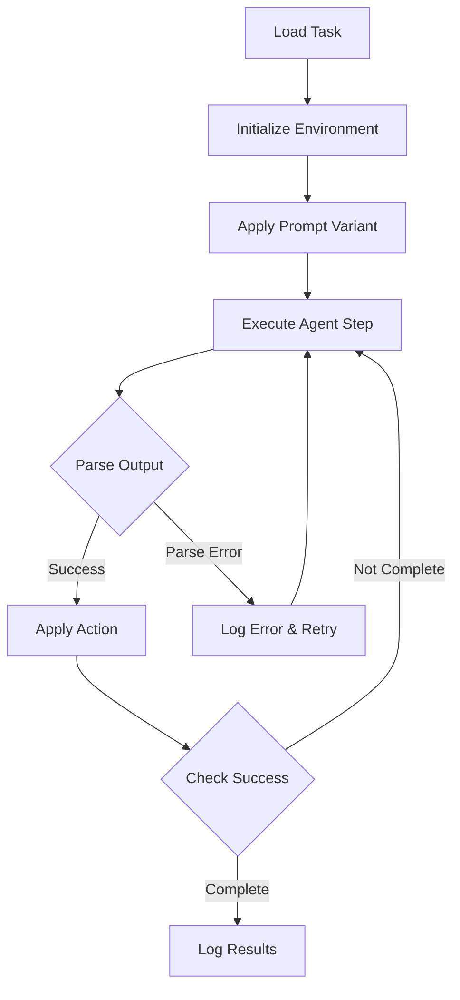

# Experiment 1 Implementation Plan: Establishing an Autonomous Baseline via System Prompt Engineering

## Executive Summary

This document outlines the comprehensive implementation plan for Experiment 1 from the "Investigating the Limits of In-Context Learning for Autonomous GUI Task Completion" research proposal. The experiment aims to transform UI-Venus-Navi from an instruction-following agent into an autonomous one that can infer user intent from visual context alone, using only system prompt engineering without any model fine-tuning or architectural changes.

## 1. Experiment Overview

### 1.1 Objective
Determine the most effective system prompt for eliciting autonomous, goal-oriented behavior from the stock UI-Venus-Navi model by systematically testing prompt variations across multiple design axes.

### 1.2 Core Hypothesis
Sophisticated reasoning required for goal inference and autonomous action can be unlocked via manipulation of the model's input context alone, without architectural changes or fine-tuning.

### 1.3 Success Metrics
- **Primary**: Success Rate (SR) on AndroidWorld benchmark without explicit task instructions
- **Secondary**: Steps to success, parse error rate, goal inference quality
- **Target**: At least one variant achieving statistically significant improvement over baseline

## 2. Technical Architecture

### 2.1 System Components

```
┌─────────────────────────────────────────────────────────┐
│                   Experiment Controller                   │
├─────────────────────────────────────────────────────────┤
│  ┌───────────────┐  ┌──────────────┐  ┌─────────────┐  │
│  │ Prompt Engine │  │   Evaluator  │  │   Analyzer  │  │
│  └───────────────┘  └──────────────┘  └─────────────┘  │
├─────────────────────────────────────────────────────────┤
│                  Modified UI-Venus-Navi                   │
│  ┌───────────────────────────────────────────────────┐  │
│  │  System-Prompt-Only Mode + Strict Output Parser   │  │
│  └───────────────────────────────────────────────────┘  │
├─────────────────────────────────────────────────────────┤
│                 AndroidWorld Environment                  │
└─────────────────────────────────────────────────────────┘
```

### 2.2 Key Modifications to Existing Code

#### 2.2.1 `models/navigation/utils.py`
```python
# New configuration flags
class PromptConfig:
    system_prompt_only: bool = False  # Enable autonomous mode
    include_history: bool = False      # Disable for initial experiments
    strict_parsing: bool = True        # Enforce output format
    decoding_config: dict              # Centralized parameters

# Modified USER_PROMPT template
AUTONOMOUS_SYSTEM_PROMPT = """
{role_framing}
{objective_description}
{tool_documentation}
{output_format_contract}
{termination_policy}
{optional_examples}
"""
```

#### 2.2.2 `models/navigation/ui_venus_navi_agent.py`
```python
# Minimal changes to support autonomous mode
def _build_query(self, goal: str = None) -> str:
    if self.config.system_prompt_only:
        # In autonomous mode, goal is inferred, not provided
        return self._build_autonomous_query()
    else:
        # Original instruction-following mode
        return USER_PROMPT.format(user_task=goal, ...)
```

## 3. Prompt Engineering Framework

### 3.1 Prompt Variation Axes

| Axis | Variants | Description |
|------|----------|-------------|
| **Role Framing** | `navigator`, `executor`, `assistant` | Agent persona and capability framing |
| **Objective Style** | `concise`, `constraints`, `verbose` | Goal description verbosity |
| **Tool Documentation** | `terse`, `moderate`, `verbose` | Action description detail level |
| **K-shot Examples** | `0`, `1`, `3` | Number of demonstration examples |
| **Error Recovery** | `none`, `brief`, `explicit` | Guidance for handling failures |
| **Termination Policy** | `strict`, `soft`, `adaptive` | Task completion criteria |

### 3.2 Prompt Variant Generation Strategy

```python
# autonomous_prompt_engineering.py
@dataclass
class PromptVariant:
    role_framing: str
    objective_style: str
    tool_docs_verbosity: str
    k_shot: int
    error_recovery: str
    termination_policy: str

    @property
    def prompt_id(self) -> str:
        """Generate stable, deterministic ID"""
        axes = f"{self.role_framing}_{self.objective_style}_{self.tool_docs_verbosity}"
        return hashlib.md5(axes.encode()).hexdigest()[:8]

    def generate_prompt(self) -> str:
        """Assemble final system prompt from template"""
        return PROMPT_TEMPLATE.format(**self.__dict__)
```

### 3.3 Initial Variant Set (18 Core Variants)

| ID | Role | Objective | Tools | K-shot | Recovery | Termination |
|----|------|-----------|-------|--------|----------|-------------|
| v01 | navigator | concise | terse | 0 | none | strict |
| v02 | navigator | concise | moderate | 1 | brief | strict |
| v03 | navigator | constraints | moderate | 1 | brief | soft |
| v04 | executor | concise | terse | 0 | none | strict |
| v05 | executor | concise | moderate | 1 | explicit | soft |
| v06 | executor | constraints | verbose | 3 | explicit | adaptive |
| v07 | assistant | concise | moderate | 1 | brief | soft |
| v08 | assistant | constraints | verbose | 1 | explicit | adaptive |
| v09 | navigator | verbose | verbose | 3 | explicit | adaptive |
| v10 | navigator | concise | terse | 1 | none | soft |
| v11 | executor | constraints | moderate | 0 | brief | strict |
| v12 | assistant | verbose | terse | 0 | none | strict |
| v13 | navigator | constraints | verbose | 1 | explicit | soft |
| v14 | executor | verbose | moderate | 3 | brief | adaptive |
| v15 | assistant | concise | verbose | 0 | explicit | strict |
| v16 | navigator | concise | moderate | 0 | brief | adaptive |
| v17 | executor | constraints | terse | 1 | none | soft |
| v18 | assistant | verbose | moderate | 3 | explicit | soft |

## 4. Evaluation Pipeline

### 4.1 AndroidWorld Integration

```python
# androidworld_autonomous_eval.py
class AndroidWorldAutonomousEvaluator:
    def __init__(self, config: EvalConfig):
        self.task_loader = AndroidWorldTaskLoader(config.split)
        self.agent = AutonomousVenusAgent(config.model_config)
        self.metrics_collector = MetricsCollector()

    def evaluate_variant(self, variant: PromptVariant, tasks: List[Task]) -> Results:
        """Run evaluation for a single prompt variant"""
        results = []
        for task in tasks:
            for replica in range(self.config.n_replicas):
                seed = self._generate_seed(variant.prompt_id, task.id, replica)
                trace = self._run_episode(variant, task, seed)
                results.append(trace)
        return self._aggregate_results(results)
```

### 4.2 Task Execution Flow



### 4.3 Metrics Collection

```python
@dataclass
class EpisodeMetrics:
    # Identifiers
    prompt_id: str
    task_id: str
    replica_idx: int

    # Performance metrics
    success: bool
    steps_taken: int
    steps_to_success: Optional[int]

    # Error tracking
    parse_errors: int
    invalid_actions: int
    timeout_reached: bool

    # Resource usage
    total_tokens_in: int
    total_tokens_out: int
    runtime_seconds: float

    # Detailed trace
    action_sequence: List[dict]
    error_log: List[dict]
```

## 5. Implementation Schedule

### Phase 1: Infrastructure (Days 1-2)
- **Day 1 AM**: Implement system-prompt-only mode in `utils.py`
- **Day 1 PM**: Create `autonomous_prompt_engineering.py` with variant generation
- **Day 2 AM**: Build `androidworld_autonomous_eval.py` evaluation runner
- **Day 2 PM**: Implement metrics collection and logging infrastructure

### Phase 2: Pilot Testing (Day 3)
- **AM**: Test on 10 AndroidWorld tasks with 3 variants
- **PM**: Debug and refine based on initial results

### Phase 3: Mini-Split Evaluation (Days 4-5)
- **Day 4**: Run 30-50 task mini-split with all 18 variants
- **Day 5 AM**: Analyze results and prune poor performers
- **Day 5 PM**: Prepare for full evaluation

### Phase 4: Full Evaluation (Days 6-7)
- **Day 6**: Run full AndroidWorld benchmark with top 5 variants
- **Day 7**: Statistical analysis and final report generation

## 6. Output Format and Logging

### 6.1 JSONL Trace Format
```json
{
  "episode_id": "v01_task042_rep0",
  "prompt_variant": {
    "prompt_id": "v01",
    "role_framing": "navigator",
    "objective_style": "concise",
    "tool_docs_verbosity": "terse",
    "k_shot": 0,
    "error_recovery": "none",
    "termination_policy": "strict"
  },
  "task": {
    "id": "task042",
    "domain": "messaging",
    "complexity": "medium"
  },
  "execution": {
    "steps": [
      {
        "step_idx": 0,
        "screenshot": "path/to/image.png",
        "model_output": "<think>...</think><action>...</action>",
        "parsed_action": {"action": "click", "params": {"box": [100, 200]}},
        "parse_status": "success",
        "execution_status": "success",
        "timestamp": 1234567890
      }
    ],
    "final_status": "success",
    "total_steps": 8,
    "total_runtime": 45.2,
    "total_tokens": {"input": 2500, "output": 800}
  }
}
```

### 6.2 Aggregate Results Format
```json
{
  "variant_id": "v01",
  "metrics": {
    "success_rate": 0.42,
    "avg_steps_to_success": 7.3,
    "avg_total_steps": 9.1,
    "parse_error_rate": 0.03,
    "invalid_action_rate": 0.05,
    "timeout_rate": 0.08,
    "avg_runtime_seconds": 48.5,
    "avg_tokens": {"input": 2800, "output": 950}
  },
  "confidence_intervals": {
    "success_rate": [0.35, 0.49],
    "avg_steps_to_success": [6.1, 8.5]
  },
  "failure_analysis": {
    "parse_errors": 12,
    "invalid_actions": 20,
    "timeouts": 32,
    "early_termination": 8,
    "navigation_errors": 45
  }
}
```

## 7. Risk Management

### 7.1 Technical Risks and Mitigations

| Risk | Probability | Impact | Mitigation |
|------|------------|--------|------------|
| Model refuses to act without explicit instructions | Medium | High | Start with semi-explicit prompts, gradually reduce explicitness |
| High parse error rate (>10%) | Medium | High | Implement lenient fallback parser with structured error recovery |
| Computational resource constraints | Low | Medium | Use mini-split for screening, parallelize evaluation |
| Non-reproducible results | Low | High | Fix all seeds, log complete configuration |
| AndroidWorld environment instability | Medium | Medium | Implement robust error handling and retry logic |

### 7.2 Fallback Strategies
1. **If autonomous mode completely fails**: Test semi-autonomous mode with partial goal hints
2. **If parse errors dominate**: Simplify output format requirements
3. **If resource constraints hit**: Reduce variant count and task set size
4. **If timeline slips**: Prioritize top-performing variants for full evaluation

## 8. Deliverables

### 8.1 Code Deliverables
- [ ] Modified `utils.py` with system-prompt-only mode
- [ ] `autonomous_prompt_engineering.py` module
- [ ] `androidworld_autonomous_eval.py` evaluation runner
- [ ] Metrics analysis and visualization scripts

### 8.2 Documentation Deliverables
- [ ] This implementation plan
- [ ] Prompt variant specifications
- [ ] Evaluation results report
- [ ] Best prompt recommendation for Experiment 2

### 8.3 Data Deliverables
- [ ] JSONL traces for all evaluation runs
- [ ] Aggregated metrics JSON
- [ ] Statistical analysis results
- [ ] Failure pattern analysis

## 9. Success Criteria

### 9.1 Minimum Viable Success
- At least one prompt variant achieves >30% success rate
- Parse error rate <5% for top variants
- Complete reproducibility demonstrated

### 9.2 Target Success
- Best variant achieves >45% success rate (comparable to modular baseline)
- Clear ranking of prompt effectiveness
- Actionable insights for Experiment 2 (ACE optimization)

### 9.3 Stretch Goals
- Variant outperforms instruction-following baseline on subset of tasks
- Identify clear prompt design principles
- Demonstrate generalization to UI-Vision benchmark

## 10. Next Steps

Upon completion of Experiment 1, the best-performing system prompt will serve as the seed for Experiment 2 (Automated Context Evolution). The insights gained about effective prompt design axes will inform the evolutionary algorithm's search space and fitness function design.

## Appendix A: Example System Prompts

### A.1 Baseline Variant (v02)
```
You are a mobile UI navigator. Your role is to analyze the current screen and determine the most likely user intent based on the visual context, then take appropriate actions to fulfill that intent.

Available actions: Click(box), Drag(start, end), Scroll(start, end, direction), Type(content), Launch(app), Wait(), Finished(content), CallUser(content), LongPress(box), PressBack(), PressHome(), PressEnter(), PressRecent()

Output format:
<think>Brief analysis of screen and inferred goal (max 40 tokens)</think>
<action>Single action from the available list with required parameters</action>
<conclusion>Only when task is complete, otherwise leave empty</conclusion>

Example:
Screen shows messaging app with unread notification.
<think>User likely wants to read new message, notification badge visible</think>
<action>Click(box=(150, 300))</action>
<conclusion></conclusion>
```

### A.2 Verbose Variant (v09)
```
You are an intelligent mobile UI navigator with expertise in understanding user intentions from visual context. Your primary objective is to analyze the current application state, infer the most probable user goal based on common interaction patterns and UI affordances, and execute appropriate actions to achieve that goal autonomously.

[Detailed action documentation with examples for each of 14 actions...]

[Multiple k-shot examples showing different scenarios...]

[Explicit error recovery and replanning guidance...]

[Adaptive termination policy with multiple success signals...]
```

## Appendix B: Resource Requirements

### B.1 Computational Resources
- GPU: 1x A100 80GB or 2x A100 40GB for UI-Venus-72B
- RAM: 128GB system memory
- Storage: 500GB for datasets, logs, and model checkpoints
- Estimated runtime: 50-70 GPU hours for full evaluation

### B.2 Software Dependencies
- PyTorch 2.0+ with CUDA 11.8+
- Transformers 4.35+
- Android emulator or device farm access
- AndroidWorld benchmark suite
- Custom evaluation harness (provided)

## Appendix C: Evaluation Checklist

- [ ] Environment setup verified
- [ ] Model checkpoints accessible
- [ ] AndroidWorld tasks loaded successfully
- [ ] Prompt variants generated and validated
- [ ] Evaluation runner tested on single task
- [ ] Metrics collection verified
- [ ] Logging infrastructure operational
- [ ] Seed reproducibility confirmed
- [ ] Resource monitoring active
- [ ] Backup strategy in place

---

*This document represents the complete implementation plan for Experiment 1. It will be updated with results and insights upon completion of the evaluation phase.*