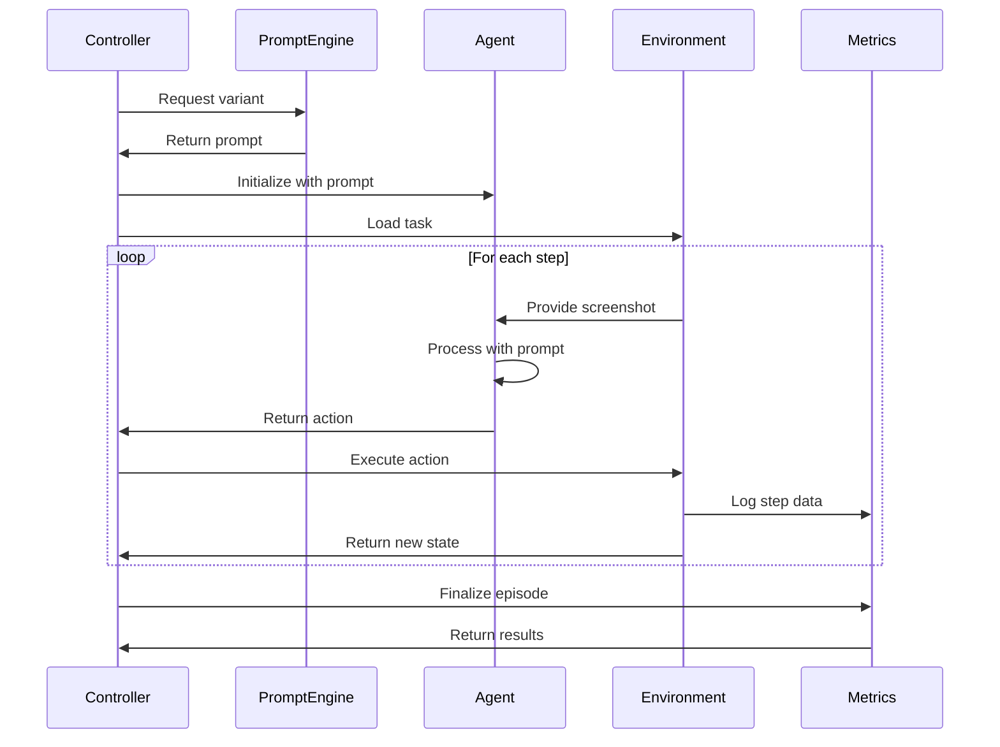

# Experiment 1: Technical Specification

## 1. System Architecture

### 1.1 Component Overview

```
┌──────────────────────────────────────────────────────────────┐
│                    Experiment 1 System                        │
├──────────────────────────────────────────────────────────────┤
│                                                                │
│  ┌──────────────────────────────────────────────────────┐    │
│  │              Experiment Controller                     │    │
│  │  ┌────────────────┐  ┌──────────────────────────┐   │    │
│  │  │ Variant Manager │  │   Evaluation Orchestrator│   │    │
│  │  └────────────────┘  └──────────────────────────┘   │    │
│  └──────────────────────────────────────────────────────┘    │
│                                                                │
│  ┌──────────────────────────────────────────────────────┐    │
│  │              Autonomous Agent Layer                    │    │
│  │  ┌────────────────┐  ┌──────────────────────────┐   │    │
│  │  │  Prompt Engine │  │    Output Parser          │   │    │
│  │  └────────────────┘  └──────────────────────────┘   │    │
│  │  ┌────────────────────────────────────────────────┐ │    │
│  │  │          Modified UI-Venus-Navi Agent          │ │    │
│  │  └────────────────────────────────────────────────┘ │    │
│  └──────────────────────────────────────────────────────┘    │
│                                                                │
│  ┌──────────────────────────────────────────────────────┐    │
│  │              Environment & Data Layer                  │    │
│  │  ┌────────────────┐  ┌──────────────────────────┐   │    │
│  │  │AndroidWorld Env│  │    Metrics Collector     │   │    │
│  │  └────────────────┘  └──────────────────────────┘   │    │
│  └──────────────────────────────────────────────────────┘    │
└──────────────────────────────────────────────────────────────┘
```

### 1.2 Data Flow



## 2. Code Specifications

### 2.1 Modified `utils.py`

```python
# models/navigation/utils.py

from dataclasses import dataclass
from typing import Optional, Dict, Any, List
import json
import re

@dataclass
class AutonomousConfig:
    """Configuration for autonomous operation mode"""
    system_prompt_only: bool = False
    include_history: bool = False
    strict_parsing: bool = True
    max_think_tokens: int = 40
    decoding_config: Optional[Dict[str, Any]] = None

    def __post_init__(self):
        if self.decoding_config is None:
            self.decoding_config = {
                'temperature': 0.0,
                'top_p': 1.0,
                'max_tokens': 2048,
                'seed': 42
            }

class AutonomousPromptBuilder:
    """Builds prompts for autonomous operation"""

    def __init__(self, config: AutonomousConfig):
        self.config = config

    def build_system_prompt(
        self,
        role_framing: str,
        objective_style: str,
        tool_docs: str,
        output_format: str,
        termination_policy: str,
        examples: Optional[str] = None,
        error_recovery: Optional[str] = None
    ) -> str:
        """Assemble system prompt from components"""

        components = [
            role_framing,
            objective_style,
            tool_docs,
            output_format,
            termination_policy
        ]

        if examples:
            components.append(examples)

        if error_recovery:
            components.append(error_recovery)

        return "\n\n".join(filter(None, components))

class StrictOutputParser:
    """Parser for model outputs with strict validation"""

    ACTION_PATTERN = re.compile(
        r'<action>(.*?)</action>',
        re.DOTALL
    )
    THINK_PATTERN = re.compile(
        r'<think>(.*?)</think>',
        re.DOTALL
    )
    CONCLUSION_PATTERN = re.compile(
        r'<conclusion>(.*?)</conclusion>',
        re.DOTALL
    )

    VALID_ACTIONS = {
        'click', 'drag', 'scroll', 'type', 'launch', 'wait',
        'finished', 'calluser', 'longpress', 'pressback',
        'presshome', 'pressenter', 'pressrecent'
    }

    def __init__(self, config: AutonomousConfig):
        self.config = config

    def parse(self, output: str) -> Dict[str, Any]:
        """Parse model output with strict validation"""

        result = {
            'think': None,
            'action': None,
            'conclusion': None,
            'parse_errors': []
        }

        # Extract think section
        think_match = self.THINK_PATTERN.search(output)
        if think_match:
            think_text = think_match.group(1).strip()
            if self.config.strict_parsing:
                # Validate think length
                token_count = len(think_text.split())
                if token_count > self.config.max_think_tokens:
                    result['parse_errors'].append(
                        f"Think section too long: {token_count} tokens"
                    )
            result['think'] = think_text
        else:
            result['parse_errors'].append("Missing <think> section")

        # Extract action section
        action_match = self.ACTION_PATTERN.search(output)
        if action_match:
            action_text = action_match.group(1).strip()
            parsed_action = self._parse_action(action_text)
            if parsed_action:
                result['action'] = parsed_action
            else:
                result['parse_errors'].append(
                    f"Invalid action format: {action_text}"
                )
        else:
            result['parse_errors'].append("Missing <action> section")

        # Extract conclusion section
        conclusion_match = self.CONCLUSION_PATTERN.search(output)
        if conclusion_match:
            result['conclusion'] = conclusion_match.group(1).strip()

        return result

    def _parse_action(self, action_text: str) -> Optional[Dict[str, Any]]:
        """Parse individual action with validation"""

        # Try to parse as function call
        match = re.match(
            r'(\w+)\((.*?)\)',
            action_text.strip()
        )

        if not match:
            return None

        action_name = match.group(1).lower()
        params_str = match.group(2)

        if action_name not in self.VALID_ACTIONS:
            return None

        # Parse parameters
        params = self._parse_params(action_name, params_str)
        if params is None:
            return None

        return {
            'action': action_name,
            'params': params
        }

    def _parse_params(
        self,
        action_name: str,
        params_str: str
    ) -> Optional[Dict[str, Any]]:
        """Parse action parameters based on action type"""

        if not params_str and action_name in ['wait', 'pressback',
                                                'presshome', 'pressenter',
                                                'pressrecent']:
            return {}

        try:
            # Parse parameters
            if action_name in ['click', 'longpress']:
                # Parse box=(x, y)
                match = re.match(r'box=\((\d+),\s*(\d+)\)', params_str)
                if match:
                    return {'box': (int(match.group(1)), int(match.group(2)))}

            elif action_name == 'drag':
                # Parse start=(x1, y1), end=(x2, y2)
                match = re.match(
                    r'start=\((\d+),\s*(\d+)\),\s*end=\((\d+),\s*(\d+)\)',
                    params_str
                )
                if match:
                    return {
                        'start': (int(match.group(1)), int(match.group(2))),
                        'end': (int(match.group(3)), int(match.group(4)))
                    }

            elif action_name == 'scroll':
                # Parse scroll parameters
                # Simplified for brevity
                return self._parse_scroll_params(params_str)

            elif action_name in ['type', 'launch', 'finished', 'calluser']:
                # Parse content/app parameter
                match = re.match(r"(?:content|app)='([^']*)'", params_str)
                if match:
                    key = 'content' if action_name != 'launch' else 'app'
                    return {key: match.group(1)}

        except (ValueError, AttributeError):
            pass

        return None

    def _parse_scroll_params(self, params_str: str) -> Optional[Dict[str, Any]]:
        """Parse scroll-specific parameters"""
        # Implementation simplified for brevity
        # Full implementation would parse start, end, and direction
        return {}
```

### 2.2 New `autonomous_prompt_engineering.py`

```python
# models/navigation/autonomous_prompt_engineering.py

from dataclasses import dataclass, field
from typing import List, Dict, Any, Optional
import hashlib
import itertools
from pathlib import Path
import json

@dataclass
class PromptVariant:
    """Represents a single prompt variant configuration"""

    role_framing: str
    objective_style: str
    tool_docs_verbosity: str
    k_shot: int
    error_recovery: str
    termination_policy: str

    # Generated fields
    prompt_id: str = field(init=False)
    system_prompt: str = field(init=False)

    def __post_init__(self):
        """Generate ID and prompt after initialization"""
        self.prompt_id = self._generate_id()
        self.system_prompt = self._generate_prompt()

    def _generate_id(self) -> str:
        """Generate deterministic ID from configuration"""
        config_str = f"{self.role_framing}_{self.objective_style}_" \
                    f"{self.tool_docs_verbosity}_{self.k_shot}_" \
                    f"{self.error_recovery}_{self.termination_policy}"
        return hashlib.md5(config_str.encode()).hexdigest()[:8]

    def _generate_prompt(self) -> str:
        """Generate full system prompt from configuration"""
        components = []

        # Add role framing
        components.append(ROLE_FRAMINGS[self.role_framing])

        # Add objective description
        components.append(OBJECTIVE_STYLES[self.objective_style])

        # Add tool documentation
        components.append(TOOL_DOCS[self.tool_docs_verbosity])

        # Add output format
        components.append(OUTPUT_FORMAT_CONTRACT)

        # Add termination policy
        components.append(TERMINATION_POLICIES[self.termination_policy])

        # Add k-shot examples if specified
        if self.k_shot > 0:
            components.append(self._get_examples(self.k_shot))

        # Add error recovery if specified
        if self.error_recovery != 'none':
            components.append(ERROR_RECOVERY_GUIDANCE[self.error_recovery])

        return "\n\n".join(components)

    def _get_examples(self, k: int) -> str:
        """Get k examples for the prompt"""
        examples = K_SHOT_EXAMPLES[:k]
        if examples:
            return "Examples:\n" + "\n".join(examples)
        return ""

    def to_dict(self) -> Dict[str, Any]:
        """Convert to dictionary for serialization"""
        return {
            'prompt_id': self.prompt_id,
            'role_framing': self.role_framing,
            'objective_style': self.objective_style,
            'tool_docs_verbosity': self.tool_docs_verbosity,
            'k_shot': self.k_shot,
            'error_recovery': self.error_recovery,
            'termination_policy': self.termination_policy,
            'system_prompt': self.system_prompt
        }

class PromptVariantGenerator:
    """Generates and manages prompt variants"""

    def __init__(self):
        self.variants = []

    def generate_core_variants(self) -> List[PromptVariant]:
        """Generate the 18 core variants for Experiment 1"""

        # Define the 18 specific combinations
        variant_configs = [
            # v01: Minimal Baseline
            ('navigator', 'concise', 'terse', 0, 'none', 'strict'),
            # v02: Guided Navigator
            ('navigator', 'concise', 'moderate', 1, 'brief', 'strict'),
            # v03: Constrained Navigator
            ('navigator', 'constraints', 'moderate', 1, 'brief', 'soft'),
            # v04: Minimal Executor
            ('executor', 'concise', 'terse', 0, 'none', 'strict'),
            # v05: Robust Executor
            ('executor', 'concise', 'moderate', 1, 'explicit', 'soft'),
            # v06: Full Executor
            ('executor', 'constraints', 'verbose', 3, 'explicit', 'adaptive'),
            # v07: Balanced Assistant
            ('assistant', 'concise', 'moderate', 1, 'brief', 'soft'),
            # v08: Adaptive Assistant
            ('assistant', 'constraints', 'verbose', 1, 'explicit', 'adaptive'),
            # v09: Maximum Navigator
            ('navigator', 'verbose', 'verbose', 3, 'explicit', 'adaptive'),
            # v10: Simple Navigator Plus
            ('navigator', 'concise', 'terse', 1, 'none', 'soft'),
            # v11: Structured Executor
            ('executor', 'constraints', 'moderate', 0, 'brief', 'strict'),
            # v12: Minimal Assistant
            ('assistant', 'verbose', 'terse', 0, 'none', 'strict'),
            # v13: Smart Navigator
            ('navigator', 'constraints', 'verbose', 1, 'explicit', 'soft'),
            # v14: Verbose Executor
            ('executor', 'verbose', 'moderate', 3, 'brief', 'adaptive'),
            # v15: Explicit Assistant
            ('assistant', 'concise', 'verbose', 0, 'explicit', 'strict'),
            # v16: Adaptive Navigator
            ('navigator', 'concise', 'moderate', 0, 'brief', 'adaptive'),
            # v17: Lean Executor
            ('executor', 'constraints', 'terse', 1, 'none', 'soft'),
            # v18: Comprehensive Assistant
            ('assistant', 'verbose', 'moderate', 3, 'explicit', 'soft'),
        ]

        self.variants = [
            PromptVariant(*config) for config in variant_configs
        ]

        return self.variants

    def save_variants(self, output_path: Path):
        """Save variants to JSON file"""
        variants_data = [v.to_dict() for v in self.variants]

        with open(output_path, 'w') as f:
            json.dump(variants_data, f, indent=2)

    def load_variants(self, input_path: Path) -> List[PromptVariant]:
        """Load variants from JSON file"""
        with open(input_path, 'r') as f:
            variants_data = json.load(f)

        self.variants = []
        for data in variants_data:
            # Extract configuration parameters
            variant = PromptVariant(
                role_framing=data['role_framing'],
                objective_style=data['objective_style'],
                tool_docs_verbosity=data['tool_docs_verbosity'],
                k_shot=data['k_shot'],
                error_recovery=data['error_recovery'],
                termination_policy=data['termination_policy']
            )
            self.variants.append(variant)

        return self.variants

# Prompt component definitions

ROLE_FRAMINGS = {
    'navigator': "You are a mobile UI navigator with expertise in understanding "
                "application interfaces and user interaction patterns.",

    'executor': "You are a task execution agent designed to complete user goals "
               "efficiently based on visual context.",

    'assistant': "You are a helpful assistant that understands what users "
                "typically want to accomplish in mobile applications."
}

OBJECTIVE_STYLES = {
    'concise': "Analyze the screen and take the next logical action based on "
              "apparent user intent.",

    'constraints': "Given the current screen state, identify the most likely "
                  "user goal considering:\n"
                  "- Common app usage patterns\n"
                  "- Visual affordances and UI hints\n"
                  "- Incomplete or in-progress workflows\n"
                  "Then execute appropriate actions to achieve that goal.",

    'verbose': "Your task is to act as an autonomous agent that can understand "
              "user intentions from visual context alone. Examine the current "
              "application screen carefully, considering all visible elements, "
              "their states, and relationships. Infer what a typical user would "
              "want to accomplish given this context, taking into account common "
              "interaction patterns, UI conventions, and logical next steps in "
              "standard workflows. Once you've identified the most probable user "
              "intent, execute the appropriate sequence of actions to fulfill "
              "that goal."
}

TOOL_DOCS = {
    'terse': "Actions: Click(box), Drag(start,end), Scroll(start,end,dir), "
            "Type(text), Launch(app), Wait(), Finished(text), CallUser(text), "
            "LongPress(box), PressBack/Home/Enter/Recent()",

    'moderate': """Available Actions:
- Click(box=(x,y)): Tap at coordinates
- Drag(start=(x1,y1), end=(x2,y2)): Swipe between points
- Scroll(start=(x,y), end=(x,y), direction='up/down/left/right'): Scroll
- Type(content='text'): Enter text in focused field
- Launch(app='name'): Open application
- Wait(): Pause for loading
- Finished(content='result'): Complete task with output
- CallUser(content='message'): Communicate with user
- Navigation: PressBack(), PressHome(), PressEnter(), PressRecent()""",

    'verbose': """Available Actions (use exactly as specified):

Click(box=(x, y))
  Purpose: Tap on UI elements like buttons, links, or fields
  Parameters: box - tuple of (x, y) coordinates
  Example: Click(box=(150, 300)) to tap a button at that location

Drag(start=(x1, y1), end=(x2, y2))
  Purpose: Swipe gestures for scrolling, sliding, or dragging elements
  Parameters: start - beginning coordinates, end - ending coordinates
  Example: Drag(start=(100, 500), end=(100, 200)) to scroll up

Scroll(start=(x, y), end=(x, y), direction='up/down/left/right')
  Purpose: Controlled scrolling in a specific direction
  Parameters: start/end coordinates and direction
  Example: Scroll(start=(200, 400), end=(200, 200), direction='up')

Type(content='text')
  Purpose: Enter text into the currently focused input field
  Parameters: content - the text string to type
  Example: Type(content='Hello World')

Launch(app='name')
  Purpose: Open a specific application
  Parameters: app - application name
  Example: Launch(app='Settings')

Wait()
  Purpose: Pause execution to allow for loading or transitions
  No parameters required

Finished(content='result')
  Purpose: Indicate task completion with optional result
  Parameters: content - completion message or extracted data
  Example: Finished(content='Task completed successfully')

CallUser(content='message')
  Purpose: Communicate information to the user
  Parameters: content - message to convey
  Example: CallUser(content='Please provide additional information')

LongPress(box=(x, y))
  Purpose: Long press gesture for context menus or selection
  Parameters: box - coordinates to long press
  Example: LongPress(box=(200, 150))

Navigation Actions:
- PressBack(): Navigate back
- PressHome(): Go to home screen
- PressEnter(): Submit or confirm
- PressRecent(): Show recent apps"""
}

OUTPUT_FORMAT_CONTRACT = """Output format:
<think>Brief reasoning about inferred goal and next action (max 40 tokens)</think>
<action>Single action from the available list with required parameters</action>
<conclusion>Only populate when task is complete, otherwise leave empty</conclusion>"""

TERMINATION_POLICIES = {
    'strict': "Use Finished(content) ONLY when you have concrete evidence the "
             "task is complete. Never terminate early. Verify success through "
             "visual confirmation.",

    'soft': "Complete the task when you believe the user's goal has been "
           "achieved. Use Finished(content) to provide results or confirm "
           "completion.",

    'adaptive': """Termination signals:
- Success indicators visible on screen
- Workflow reaches natural endpoint
- No more productive actions available
- User goal appears satisfied based on context"""
}

ERROR_RECOVERY_GUIDANCE = {
    'brief': "If an action fails, try alternative approaches to achieve the goal.",

    'explicit': """Error Recovery Protocol:
- If click fails: Check if element moved, try nearby coordinates
- If typing fails: Ensure field is focused first
- If navigation blocked: Use alternative paths (back button, menu)
- After 2 failed attempts: Try different interpretation of user intent"""
}

K_SHOT_EXAMPLES = [
    # Example 1: Notification handling
    """Example 1:
Screen: Messaging app showing conversation list with unread badge on "Mom" chat
<think>User likely wants to read new message from Mom, unread indicator visible</think>
<action>Click(box=(150, 200))</action>
<conclusion></conclusion>""",

    # Example 2: Form completion
    """Example 2:
Screen: Registration form with filled name and email, empty password field
<think>User filling registration form, password field needs completion</think>
<action>Click(box=(200, 350))</action>
<conclusion></conclusion>""",

    # Example 3: Navigation task
    """Example 3:
Screen: Settings app main page showing various option categories
<think>Common task is checking notifications settings, will navigate there</think>
<action>Click(box=(100, 250))</action>
<conclusion></conclusion>"""
]
```

### 2.3 New `androidworld_autonomous_eval.py`

```python
# evaluation/androidworld_autonomous_eval.py

import json
import time
import logging
from pathlib import Path
from typing import List, Dict, Any, Optional, Tuple
from dataclasses import dataclass, asdict
import hashlib
import traceback
from concurrent.futures import ThreadPoolExecutor, as_completed
import numpy as np

@dataclass
class EpisodeConfig:
    """Configuration for a single evaluation episode"""
    variant_id: str
    task_id: str
    replica_idx: int
    seed: int
    max_steps: int = 15
    step_timeout: float = 10.0
    episode_timeout: float = 120.0

@dataclass
class EpisodeResult:
    """Result from a single evaluation episode"""
    config: EpisodeConfig
    success: bool
    steps_taken: int
    steps_to_success: Optional[int]
    parse_errors: int
    invalid_actions: int
    timeout_reached: bool
    total_tokens_in: int
    total_tokens_out: int
    runtime_seconds: float
    action_sequence: List[Dict[str, Any]]
    error_log: List[Dict[str, Any]]
    final_screen: Optional[str]
    failure_reason: Optional[str]

    def to_dict(self) -> Dict[str, Any]:
        """Convert to dictionary for JSON serialization"""
        result = asdict(self)
        result['config'] = asdict(self.config)
        return result

class AndroidWorldAutonomousEvaluator:
    """Main evaluator for autonomous agent on AndroidWorld"""

    def __init__(
        self,
        model_config: Any,
        eval_config: Dict[str, Any],
        logger: Optional[logging.Logger] = None
    ):
        self.model_config = model_config
        self.eval_config = eval_config
        self.logger = logger or self._setup_logger()

        # Initialize components
        self.task_loader = AndroidWorldTaskLoader(eval_config['task_split'])
        self.agent = self._initialize_agent()
        self.metrics_collector = MetricsCollector()

        # Setup paths
        self.output_dir = Path(eval_config.get('output_dir', './results'))
        self.output_dir.mkdir(parents=True, exist_ok=True)

    def _setup_logger(self) -> logging.Logger:
        """Setup default logger"""
        logger = logging.getLogger('AndroidWorldEval')
        logger.setLevel(logging.INFO)

        handler = logging.StreamHandler()
        formatter = logging.Formatter(
            '%(asctime)s - %(name)s - %(levelname)s - %(message)s'
        )
        handler.setFormatter(formatter)
        logger.addHandler(handler)

        return logger

    def _initialize_agent(self):
        """Initialize the autonomous agent"""
        from models.navigation.ui_venus_navi_agent import VenusNaviAgent

        # Create agent with autonomous configuration
        agent = VenusNaviAgent(
            model_config=self.model_config,
            logger=self.logger,
            history_length=0  # No history for initial experiments
        )

        # Set autonomous mode
        agent.autonomous_mode = True

        return agent

    def evaluate_all_variants(
        self,
        variants: List[Any],
        tasks: Optional[List[Dict]] = None,
        n_replicas: int = 2,
        max_workers: int = 1
    ) -> Dict[str, Any]:
        """Evaluate all prompt variants on the task set"""

        if tasks is None:
            tasks = self.task_loader.load_tasks()

        self.logger.info(
            f"Starting evaluation: {len(variants)} variants, "
            f"{len(tasks)} tasks, {n_replicas} replicas"
        )

        all_results = []
        variant_results = {}

        # Iterate through variants
        for variant in variants:
            self.logger.info(f"Evaluating variant {variant.prompt_id}")

            variant_episodes = []

            # Run episodes for this variant
            if max_workers > 1:
                # Parallel execution
                with ThreadPoolExecutor(max_workers=max_workers) as executor:
                    futures = []

                    for task in tasks:
                        for replica_idx in range(n_replicas):
                            config = self._create_episode_config(
                                variant.prompt_id,
                                task['id'],
                                replica_idx
                            )

                            future = executor.submit(
                                self._run_episode,
                                variant,
                                task,
                                config
                            )
                            futures.append(future)

                    # Collect results
                    for future in as_completed(futures):
                        try:
                            result = future.result()
                            variant_episodes.append(result)
                            all_results.append(result)
                        except Exception as e:
                            self.logger.error(f"Episode failed: {e}")
            else:
                # Serial execution
                for task in tasks:
                    for replica_idx in range(n_replicas):
                        config = self._create_episode_config(
                            variant.prompt_id,
                            task['id'],
                            replica_idx
                        )

                        try:
                            result = self._run_episode(variant, task, config)
                            variant_episodes.append(result)
                            all_results.append(result)
                        except Exception as e:
                            self.logger.error(
                                f"Episode failed: {e}\n{traceback.format_exc()}"
                            )

            # Aggregate variant results
            variant_results[variant.prompt_id] = self._aggregate_results(
                variant_episodes
            )

            # Save intermediate results
            self._save_results(variant.prompt_id, variant_episodes)

        # Generate final report
        final_report = self._generate_report(variant_results)

        return final_report

    def _create_episode_config(
        self,
        variant_id: str,
        task_id: str,
        replica_idx: int
    ) -> EpisodeConfig:
        """Create configuration for a single episode"""

        # Generate deterministic seed
        seed_str = f"{variant_id}_{task_id}_{replica_idx}"
        seed = int(hashlib.md5(seed_str.encode()).hexdigest()[:8], 16) % (2**31)

        return EpisodeConfig(
            variant_id=variant_id,
            task_id=task_id,
            replica_idx=replica_idx,
            seed=seed,
            max_steps=self.eval_config.get('max_steps', 15),
            step_timeout=self.eval_config.get('step_timeout', 10.0),
            episode_timeout=self.eval_config.get('episode_timeout', 120.0)
        )

    def _run_episode(
        self,
        variant: Any,
        task: Dict[str, Any],
        config: EpisodeConfig
    ) -> EpisodeResult:
        """Run a single evaluation episode"""

        start_time = time.time()

        # Initialize episode tracking
        steps_taken = 0
        parse_errors = 0
        invalid_actions = 0
        action_sequence = []
        error_log = []
        success = False
        steps_to_success = None
        timeout_reached = False
        failure_reason = None

        # Token counting (simplified)
        total_tokens_in = 0
        total_tokens_out = 0

        try:
            # Initialize environment
            env = self._setup_environment(task, config.seed)

            # Set agent prompt
            self.agent.set_system_prompt(variant.system_prompt)

            # Reset agent state
            self.agent.reset()

            # Run episode
            while steps_taken < config.max_steps:
                step_start = time.time()

                # Check episode timeout
                if time.time() - start_time > config.episode_timeout:
                    timeout_reached = True
                    failure_reason = "episode_timeout"
                    break

                # Get current screenshot
                screenshot_path = env.get_screenshot()

                # Agent step (no explicit goal provided)
                try:
                    action_result = self.agent.step(
                        goal=None,  # Autonomous mode - no goal
                        image_path=screenshot_path
                    )

                    # Track tokens (simplified - would need actual counts)
                    total_tokens_in += 1000  # Placeholder
                    total_tokens_out += 100  # Placeholder

                except Exception as e:
                    parse_errors += 1
                    error_log.append({
                        'step': steps_taken,
                        'error': str(e),
                        'type': 'parse_error'
                    })
                    action_result = None

                if action_result:
                    # Execute action in environment
                    try:
                        exec_result = env.execute_action(action_result)

                        action_sequence.append({
                            'step': steps_taken,
                            'action': action_result,
                            'result': exec_result
                        })

                        # Check for task completion
                        if exec_result.get('task_complete', False):
                            success = True
                            steps_to_success = steps_taken + 1
                            break

                        # Check if action is 'finished'
                        if action_result.get('action') == 'finished':
                            # Verify if actually successful
                            success = env.check_success()
                            if success:
                                steps_to_success = steps_taken + 1
                            else:
                                failure_reason = "premature_termination"
                            break

                    except Exception as e:
                        invalid_actions += 1
                        error_log.append({
                            'step': steps_taken,
                            'error': str(e),
                            'type': 'invalid_action'
                        })

                steps_taken += 1

                # Check step timeout
                if time.time() - step_start > config.step_timeout:
                    error_log.append({
                        'step': steps_taken,
                        'error': 'Step timeout',
                        'type': 'timeout'
                    })

            # Final success check if not already determined
            if not success and not failure_reason:
                success = env.check_success()
                if not success:
                    failure_reason = "max_steps_reached"

            # Get final screenshot
            final_screen = env.get_screenshot()

        except Exception as e:
            self.logger.error(f"Episode error: {e}\n{traceback.format_exc()}")
            failure_reason = f"exception: {str(e)}"
            final_screen = None
        finally:
            # Cleanup environment
            try:
                env.cleanup()
            except:
                pass

        runtime_seconds = time.time() - start_time

        return EpisodeResult(
            config=config,
            success=success,
            steps_taken=steps_taken,
            steps_to_success=steps_to_success,
            parse_errors=parse_errors,
            invalid_actions=invalid_actions,
            timeout_reached=timeout_reached,
            total_tokens_in=total_tokens_in,
            total_tokens_out=total_tokens_out,
            runtime_seconds=runtime_seconds,
            action_sequence=action_sequence,
            error_log=error_log,
            final_screen=final_screen,
            failure_reason=failure_reason
        )

    def _setup_environment(self, task: Dict, seed: int):
        """Setup AndroidWorld environment for task"""
        # This would integrate with actual AndroidWorld
        # Simplified mock for specification
        return AndroidWorldEnvironmentMock(task, seed)

    def _aggregate_results(
        self,
        episodes: List[EpisodeResult]
    ) -> Dict[str, Any]:
        """Aggregate results from multiple episodes"""

        if not episodes:
            return {}

        # Calculate metrics
        success_rate = np.mean([e.success for e in episodes])

        successful_episodes = [e for e in episodes if e.success]

        if successful_episodes:
            avg_steps_to_success = np.mean(
                [e.steps_to_success for e in successful_episodes]
            )
        else:
            avg_steps_to_success = None

        avg_total_steps = np.mean([e.steps_taken for e in episodes])
        parse_error_rate = np.mean([e.parse_errors > 0 for e in episodes])
        invalid_action_rate = np.mean([e.invalid_actions > 0 for e in episodes])
        timeout_rate = np.mean([e.timeout_reached for e in episodes])

        avg_runtime = np.mean([e.runtime_seconds for e in episodes])
        avg_tokens_in = np.mean([e.total_tokens_in for e in episodes])
        avg_tokens_out = np.mean([e.total_tokens_out for e in episodes])

        # Failure analysis
        failure_reasons = {}
        for e in episodes:
            if not e.success and e.failure_reason:
                reason = e.failure_reason
                failure_reasons[reason] = failure_reasons.get(reason, 0) + 1

        return {
            'num_episodes': len(episodes),
            'metrics': {
                'success_rate': float(success_rate),
                'avg_steps_to_success': float(avg_steps_to_success) if avg_steps_to_success else None,
                'avg_total_steps': float(avg_total_steps),
                'parse_error_rate': float(parse_error_rate),
                'invalid_action_rate': float(invalid_action_rate),
                'timeout_rate': float(timeout_rate),
                'avg_runtime_seconds': float(avg_runtime),
                'avg_tokens': {
                    'input': float(avg_tokens_in),
                    'output': float(avg_tokens_out)
                }
            },
            'failure_analysis': failure_reasons
        }

    def _save_results(self, variant_id: str, episodes: List[EpisodeResult]):
        """Save episode results to file"""

        output_file = self.output_dir / f"episodes_{variant_id}.jsonl"

        with open(output_file, 'w') as f:
            for episode in episodes:
                f.write(json.dumps(episode.to_dict()) + '\n')

        self.logger.info(f"Saved {len(episodes)} episodes to {output_file}")

    def _generate_report(
        self,
        variant_results: Dict[str, Dict[str, Any]]
    ) -> Dict[str, Any]:
        """Generate final evaluation report"""

        # Sort variants by success rate
        sorted_variants = sorted(
            variant_results.items(),
            key=lambda x: x[1]['metrics']['success_rate'],
            reverse=True
        )

        report = {
            'evaluation_config': self.eval_config,
            'num_variants': len(variant_results),
            'variant_results': variant_results,
            'leaderboard': [
                {
                    'rank': i + 1,
                    'variant_id': vid,
                    'success_rate': results['metrics']['success_rate'],
                    'avg_steps': results['metrics']['avg_total_steps']
                }
                for i, (vid, results) in enumerate(sorted_variants)
            ],
            'best_variant': sorted_variants[0][0] if sorted_variants else None
        }

        # Save report
        report_file = self.output_dir / 'evaluation_report.json'
        with open(report_file, 'w') as f:
            json.dump(report, f, indent=2)

        self.logger.info(f"Saved evaluation report to {report_file}")

        return report

# Supporting classes (simplified for specification)

class AndroidWorldTaskLoader:
    """Loads tasks from AndroidWorld benchmark"""

    def __init__(self, split: str):
        self.split = split

    def load_tasks(self) -> List[Dict[str, Any]]:
        """Load tasks for evaluation"""
        # This would load actual AndroidWorld tasks
        # Simplified for specification
        return []

class MetricsCollector:
    """Collects and aggregates metrics"""
    pass

class AndroidWorldEnvironmentMock:
    """Mock environment for specification"""

    def __init__(self, task: Dict, seed: int):
        self.task = task
        self.seed = seed

    def get_screenshot(self) -> str:
        return "path/to/screenshot.png"

    def execute_action(self, action: Dict) -> Dict:
        return {'success': True}

    def check_success(self) -> bool:
        return False

    def cleanup(self):
        pass
```

## 3. Integration Points

### 3.1 With Existing UI-Venus Code

```python
# Minimal modifications to ui_venus_navi_agent.py

class VenusNaviAgent:
    def __init__(self, model_config, logger, history_length=0):
        # ... existing initialization ...
        self.autonomous_mode = False
        self.system_prompt = None

    def set_system_prompt(self, prompt: str):
        """Set system prompt for autonomous operation"""
        self.system_prompt = prompt
        self.autonomous_mode = True

    def step(self, goal: str = None, image_path: str = None):
        """Modified to support autonomous mode"""

        if self.autonomous_mode and goal is None:
            # Use system prompt instead of user task
            user_query = self._build_autonomous_query()
        else:
            # Original behavior
            user_query = self._build_query(goal)

        # Rest of the implementation remains the same
        # ...
```

### 3.2 With AndroidWorld Benchmark

The integration assumes AndroidWorld provides:
- Task definitions with initial states
- Success checking mechanisms
- Screenshot capture capabilities
- Action execution interface

## 4. Testing Strategy

### 4.1 Unit Tests

```python
# tests/test_autonomous_prompting.py

def test_prompt_variant_generation():
    """Test that all 18 variants are generated correctly"""
    generator = PromptVariantGenerator()
    variants = generator.generate_core_variants()
    assert len(variants) == 18
    assert all(v.prompt_id for v in variants)
    assert len(set(v.prompt_id for v in variants)) == 18  # All unique

def test_output_parser():
    """Test strict output parsing"""
    parser = StrictOutputParser(AutonomousConfig())

    # Valid output
    output = "<think>Need to click button</think><action>Click(box=(100, 200))</action>"
    result = parser.parse(output)
    assert result['action']['action'] == 'click'
    assert result['action']['params']['box'] == (100, 200)
    assert len(result['parse_errors']) == 0
```

### 4.2 Integration Tests

```python
def test_episode_execution():
    """Test single episode execution"""
    # Setup
    evaluator = AndroidWorldAutonomousEvaluator(...)
    variant = PromptVariant(...)
    task = {'id': 'test_task', ...}

    # Execute
    result = evaluator._run_episode(variant, task, config)

    # Verify
    assert result.steps_taken > 0
    assert result.runtime_seconds > 0
```

## 5. Configuration Files

### 5.1 Experiment Configuration

```yaml
# configs/experiment1.yaml

experiment:
  name: "Autonomous System Prompt Engineering"
  version: "1.0"

model:
  path: "inclusionAI/UI-Venus-Navi-7B"
  max_tokens: 2048
  temperature: 0.0
  seed: 42

evaluation:
  task_split: "mini"  # Start with mini split
  n_replicas: 2
  max_workers: 1  # Serial execution initially
  max_steps: 15
  step_timeout: 10.0
  episode_timeout: 120.0
  output_dir: "./results/experiment1"

variants:
  count: 18
  definition_file: "./configs/prompt_variants.json"
```

## 6. Deployment Checklist

- [ ] Code implementation complete
- [ ] Unit tests passing
- [ ] Integration tests passing
- [ ] AndroidWorld environment setup
- [ ] GPU resources allocated
- [ ] Logging configured
- [ ] Output directories created
- [ ] Backup strategy in place
- [ ] Monitoring active
- [ ] Documentation complete

---

*This technical specification provides the complete implementation details for Experiment 1. Updates will be made based on implementation discoveries and results.*